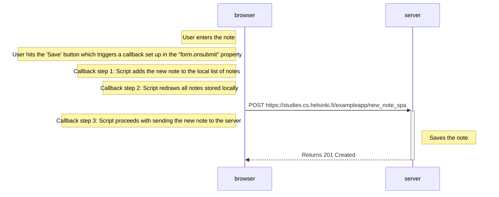

```mermaid
sequenceDiagram
    participant browser
    participant server

    Note left of browser: User enters the note
    Note left of browser: User hits the 'Save' button which triggers a callback set up in the "form.onsubmit" property
    Note left of browser: Callback step 1: Script adds the new note to the local list of notes
    Note left of browser: Callback step 2: Script redraws all notes stored locally

    browser->>+server: POST https://studies.cs.helsinki.fi/exampleapp/new_note_spa
    Note left of browser: Callback step 3: Script proceeds with sending the new note to the server
    Note right of server: Saves the note
    server-->>-browser: Returns 201 Created
```
